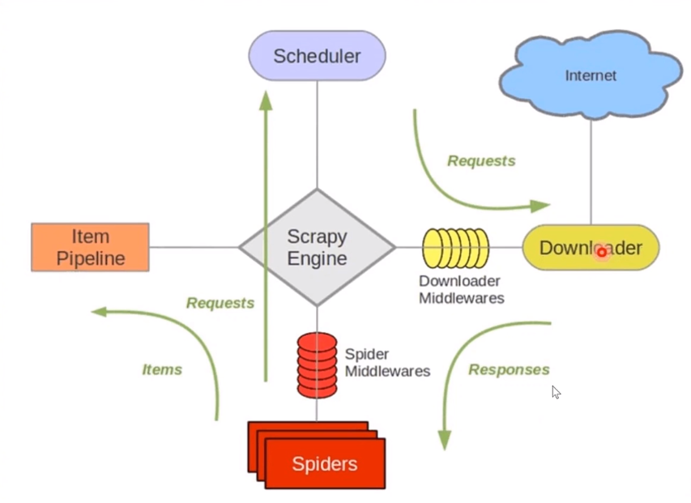

* Scheduler：所有待爬取和已爬取的由 `Scheduler` 管理
* Downloader：将URL交给 `Downloader` 负责资源的下载
* Spiders：`Downloader` 下载完毕之后会返回一个 `response` 对象,交给爬虫解析器（ `Spiders` ）然后解析出有价值的数据，
然后有新的URL又可以交给 `Scheduler` 来调度管理
* Item Pipeline ：将 `Spiders` 分析后有价值的数据封装成实体 `Items` 交给组件 `Item Pipeline` 而 `Item Pipeline` 
主要是跟数据库打交道
* ScraPy Engine：爬虫调度器，管理组件之间的调度
* Middlewares：有点像java中的拦截器，在请求发送的时候可以进行拦截，来实现 User-Agent 和 IP 的伪装；模拟 ajax点击
将最终加载处理完的页面交给 `Spiders`

# 安装 scrapy

```lua
$ pip install scrapy
```

# 查看 scrapy 帮助文档
脚本文件默认全部存放在当前虚拟环境下的 `Script`

```lua
$ scrapy -h
```

# 创建一个 scrapy 项目

查看对应的帮助

```lua
$ scrapy startproject -h
Usage
=====
  scrapy startproject <project_name> [project_dir]
......
```

创建一个 scrapy 项目

```lua
$ scrapy startproject doban ./scrapy
New Scrapy project 'douban', using template directory 'e:\workspace\github\python-learn\venv\lib\site-packages\scrapy\templates\project', created in:
    E:\workspace\github\python-learn\scrapy

You can start your first spider with:
    cd ./scrapy
    scrapy genspider example example.com
```

目录结构

```lua
douban
 ├── spiders -- 解析器
 ├── __init__.py
 ├── items.py
 ├── middlewares.py
 ├── pipelines.py
 ├── settings.py -- 配置文件
scrapy.cfg -- 项目总配置文件
```

# 创建一个爬虫解析器（spider）

进入对应的项目通过下面命令创建

`scrapy genspider [options] <name> <domain>`

```lua
$ scrapy genspider douban_spider movie.douban.com
Created spider 'douban_spider' using template 'basic' in module:
  douban.spiders.douban_spider
```
douban/spiders/douban_spider.py
```python
# -*- coding: utf-8 -*-
import scrapy


class DoubanSpiderSpider(scrapy.Spider):
    # 项目名称
    name = 'douban_spider'
    # 允许下载域名
    allowed_domains = ['movie.douban.com']
    # 下载首地址
    start_urls = ['http://movie.douban.com/top250']
    # 下载完成的返回方法
    def parse(self, response):
        # 下载的html源代码
        print(response.text)
```

# 运行爬虫
` scrapy crawl [options] <spider>`

```lua
$ scrapy crawl douban_spider
```

# 配置 User-Agent
douban/settings.py
```python
# Override the default request headers:
DEFAULT_REQUEST_HEADERS = {
    'Accept': 'text/html,application/xhtml+xml,application/xml;q=0.9,*/*;q=0.8',
    'Accept-Language': 'en',
    'User-Agent': 'Mozilla/5.0 (Windows NT 10.0; Win64; x64) AppleWebKit/537.36 (KHTML, like Gecko) \
Chrome/77.0.3865.90 Safari/537.36',
}
```
# 关闭robots协议

框架默认会去读取 robots 文件，关闭掉有利于学习

```python
# Obey robots.txt rules
ROBOTSTXT_OBEY = False
```

# 爬取豆瓣电影TPO250

```python
# -*- coding: utf-8 -*-
import scrapy
from lxml import etree
from douban.items import DoubanItem


class DoubanSpiderSpider(scrapy.Spider):
    # 项目名称
    name = 'douban_spider'
    # 允许下载域名
    allowed_domains = ['movie.douban.com']
    # 下载首地址
    start_urls = ['http://movie.douban.com/top250']

    # 下载完成的返回方法
    def parse(self, response):
        # 下载的html源代码
        html = etree.HTML(response.text)
        lis = html.xpath("//ol[@class='grid_view']/li")
        for li in lis:
            # yield 返回一个迭代器，通过next()方法获取元素
            yield DoubanItem({
                "ranking": li.xpath(".//em/text()")[0],  # 排名
                "cover_url": li.xpath(".//img/@src")[0],  # 封面图
                "jump_url": li.xpath(".//div[@class='hd']/a/@href")[0],  # 跳转
                "title": li.xpath(".//span[@class='title']/text()")[0],  # 标题
                "score": li.xpath(".//span[@class='rating_num']/text()")[0]  # 评分
            })
        try:
            # 获取翻页链接信息
            next_page = html.xpath(".//span[@class='next']/a/@href")[0]
            # 手动发送请求下一页数据
            yield scrapy.Request(self.start_urls[0]+next_page,callback = self.parse)
        except:
             print("下载完毕")
```

# User-Gent 伪装

douban/middlewares.py

```python
import random
# 每个发送的请求都会进入该方法
class UserAgentMiddleware(object):
    def process_request(self, request, spider):
        USER_AGENTS = [
            "Mozilla/4.0 (compatible; MSIE 6.0; Windows NT 5.1; SV1; AcooBrowser; .NET CLR 1.1.4322; .NET CLR 2.0.507\
            27)",
            "Mozilla/4.0 (compatible; MSIE 7.0; Windows NT 6.0; Acoo Browser; SLCC1; .NET CLR 2.0.50727; Media Center \
            PC 5.0; .NET CLR 3.0.04506)",
            "Mozilla/4.0 (compatible; MSIE 7.0; AOL 9.5; AOLBuild 4337.35; Windows NT 5.1; .NET CLR 1.1.4322; .NET CLR\
             2.0.50727)",
            "Mozilla/5.0 (Windows; U; MSIE 9.0; Windows NT 9.0; en-US)",
            "Mozilla/5.0 (compatible; MSIE 9.0; Windows NT 6.1; Win64; x64; Trident/5.0; .NET CLR 3.5.30729; .NET CLR\
             3.0.30729; .NET CLR 2.0.50727; Media Center PC 6.0)",
            "Mozilla/5.0 (compatible; MSIE 8.0; Windows NT 6.0; Trident/4.0; WOW64; Trident/4.0; SLCC2; .NET CLR 2.0.\
            50727; .NET CLR 3.5.30729; .NET CLR 3.0.30729; .NET CLR 1.0.3705; .NET CLR 1.1.4322)",
            "Mozilla/4.0 (compatible; MSIE 7.0b; Windows NT 5.2; .NET CLR 1.1.4322; .NET CLR 2.0.50727; InfoPath.2; .\
            NET CLR 3.0.04506.30)",
            "Mozilla/5.0 (Windows; U; Windows NT 5.1; zh-CN) AppleWebKit/523.15 (KHTML, like Gecko, Safari/419.3) Aro\
            ra/0.3 (Change: 287 c9dfb30)",
            "Mozilla/5.0 (X11; U; Linux; en-US) AppleWebKit/527+ (KHTML, like Gecko, Safari/419.3) Arora/0.6",
            "Mozilla/5.0 (Windows; U; Windows NT 5.1; en-US; rv:1.8.1.2pre) Gecko/20070215 K-Ninja/2.1.1",
            "Mozilla/5.0 (Windows; U; Windows NT 5.1; zh-CN; rv:1.9) Gecko/20080705 Firefox/3.0 Kapiko/3.0",
            "Mozilla/5.0 (X11; Linux i686; U;) Gecko/20070322 Kazehakase/0.4.5",
            "Mozilla/5.0 (X11; U; Linux i686; en-US; rv:1.9.0.8) Gecko Fedora/1.9.0.8-1.fc10 Kazehakase/0.5.6",
            "Mozilla/5.0 (Windows NT 6.1; WOW64) AppleWebKit/535.11 (KHTML, like Gecko) Chrome/17.0.963.56 Safari/535\
            .11",
            "Mozilla/5.0 (Macintosh; Intel Mac OS X 10_7_3) AppleWebKit/535.20 (KHTML, like Gecko) Chrome/19.0.1036.7 \
            Safari/535.20",
            "Opera/9.80 (Macintosh; Intel Mac OS X 10.6.8; U; fr) Presto/2.9.168 Version/11.52"]
        request.headers['User-Agent'] = random.choice(USER_AGENTS)
        return None
```
如果改变了默认生成的middlewares类需要修改对应的配置文件
```python
# Enable or disable downloader middlewares
# See https://docs.scrapy.org/en/latest/topics/downloader-middleware.html
DOWNLOADER_MIDDLEWARES = {
   'douban.middlewares.UserAgentMiddleware': 543,
}
```
'douban.middlewares.UserAgentMiddleware' 处理类名称，后面的值代表优先级

# IP伪装
ip伪装是将我们的请求发送给第三方服务器，然后由第三方转发到目标服务；第三方每次转发会生成一个新的IP (要钱)

如： [阿布云](https://www.abuyun.com/http-proxy/dyn-manual-python.html)

跟设置 UserAgentMiddleware 流程一样
```python
 #! -*- encoding:utf-8 -*-
    import base64
    # 代理服务器
    proxyServer = "http://http-dyn.abuyun.com:9020"

    # 代理隧道验证信息
    proxyUser = "H01234567890123D"
    proxyPass = "0123456789012345"

    # for Python2
    proxyAuth = "Basic " + base64.b64encode(proxyUser + ":" + proxyPass)

    # for Python3
    #proxyAuth = "Basic " + base64.urlsafe_b64encode(bytes((proxyUser + ":" + proxyPass), "ascii")).decode("utf8")

    class ProxyMiddleware(object):
        def process_request(self, request, spider):
            request.meta["proxy"] = proxyServer

            request.headers["Proxy-Authorization"] = proxyAuth    
```

# 自动登录

```python
# -*- coding: utf-8 -*-
import scrapy


class RenrenSpider(scrapy.Spider):
    name = 'renren_spider'
    allowed_domains = ['www.renren.com']
    start_urls = ['http://www.renren.com/SysHome.do']

    def parse(self, response):
        # 使用 FormRequest 发送一个登录 form 表单，登录成功进入 callback
        loginForm = {
            "email":"xxx@qq.com",
            "password":"xxx"
        }
        return scrapy.FormRequest(url="http://www.renren.com/PLogin.do",formdata=loginForm,callback=self.login_callback)


    def login_callback(self,response):
        print(response.text)
```

# 入库

`spider` 处理返回的数据会交给 `pipelines` 触法调用 `process_item` 进行入库处理

默认 `pipelines` 是没有开启的,在配置文件中开启

```python
# Configure item pipelines
# See https://docs.scrapy.org/en/latest/topics/item-pipeline.html
ITEM_PIPELINES = {
   'jianshu.pipelines.JianshuPipeline': 300,
}
```
JianshuPipeline.process_item 会被出发，然后做具体的入库操作

```python
# -*- coding: utf-8 -*-

# Define your item pipelines here
#
# Don't forget to add your pipeline to the ITEM_PIPELINES setting
# See: https://docs.scrapy.org/en/latest/topics/item-pipeline.html

import pymysql

class JianshuPipeline(object):

    def __init__(self):
        con_param = {
            "host":"127.0.0.1",
            "port":3306,
            "database":"jianshu",
            "user":"root",
            "password":"root"
        }
        self.db = pymysql.connect(**con_param)
        self.cursor = self.db.cursor()

    def process_item(self, item, spider):
        try:
            insert_sql = "INSERT INTO `jianshu_article_base_info` (`author_nickname`,`author_avatar`,`title`,`url`)\
                 VALUES (%s, %s, %s,%s)"
            self.cursor.execute(insert_sql,(item["author_nickname"],item["author_avatar"],item["title"],item["url"]))
            self.db.commit()
        except:
            print("执行SQL异常")
            self.db.rollback()

        return item
```

